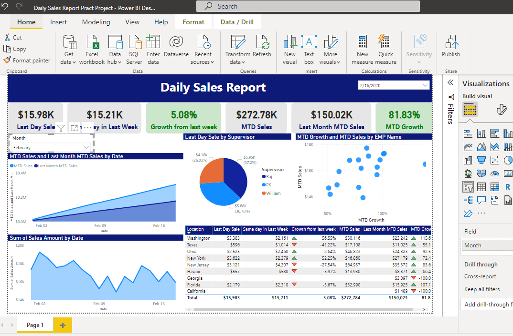

# Daily-Sales-Report-Dashboard

# Project Desription

In this project,  we have created a Daily Sales Report (DSR) in Microsoft Power BI. We have extracted and consolidated the data from multiple PDF files using Power Query. After applying the proper data transformation, we have create this visual Report,Visualization, for effective Communication.

# Dashboard Screenshot

# DATA Table Screenshot

# SKILLS DISPLAYED
Data Extraction,
Data Consolidation,
Power Query,
Data Tranformation,
Effective Visualization.

## CONCLUSION
In conclusion, this project successfully demonstrated the application of various skills, including data extraction, data consolidation, Power Query, data transformation, and effective visualization. By leveraging Microsoft Power BI, we were able to extract and consolidate data from multiple PDF files, transforming it into a Daily Sales Report (DSR) that provides valuable insights. The visual report and visualization created through this process ensure effective communication of the data, enabling stakeholders to make informed decisions based on the presented information. Overall, this project exemplifies the proficiency in handling data and leveraging the capabilities of Power BI for data analysis and reporting purposes.
